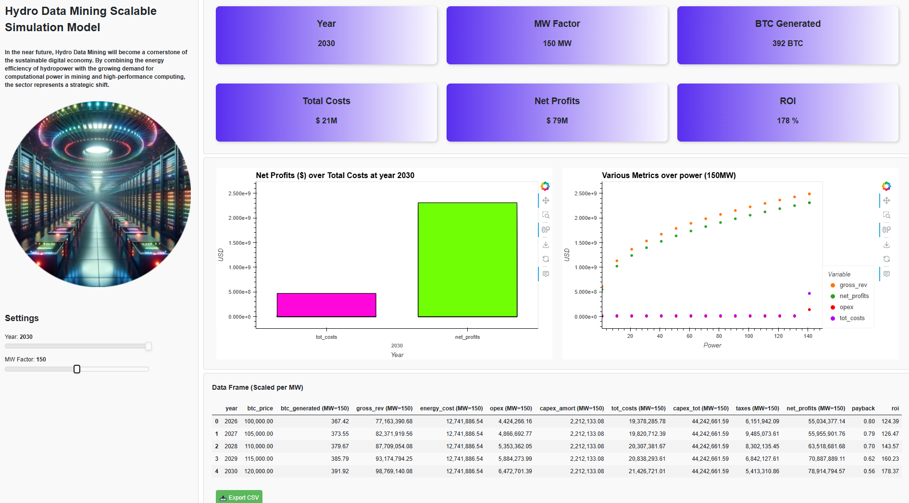

# 🐍 Python Dashboard Hydro Mininig Model

[](https://www.python.org/downloads/)
[](https://panel.holoviz.org/)
[](https://opensource.org/licenses/MIT)

Interactive visualization dashboard in Python with [Panel](https://panel.holoviz.org/).

This repository contains code for a portfolio project showcasing an interactive dashboard built with Panel.

If you want to see all the dependencies for this project, please refer to the `requirements.txt` file.

## Overview

This project offers an interactive visualization dashboard that models both Bitcoin mining performance and detailed economic metrics across the 2026-2030 period. It dynamically scales operational and financial indicators based on power consumption and economic assumptions, allowing users to explore realistic nonlinear growth patterns, investment impacts, and forecast scenarios.

## Model Structure

- **Data Preparation and Cleaning**  
  Processes datasets relevant for 2026-2030, including forecasts of operating metrics, capital expenditures, revenues, costs, and depreciatio.

- **Dynamic Metrics Scaling Functions**  
  Applies nonlinear growth functions to scale key metrics by power input (MW):
  - Slow logarithmic growth for cost-related metrics (energy cost, OPEX, CAPEX amortization, taxes, total costs).
  - Combined square root and logarithmic growth for gross revenues and net profits, modeling controlled, faster growth with diminishing returns.

- **Economic Metric Calculations**  
  Computes aggregate financial indicators—including total income, investment dynamics, depreciation expenses, cost breakdowns, and annual net returns—capturing temporal compounding and scenario variations over 2026-2030.

- **Interactive Dashboard Components**  
  Provides widgets (sliders, dropdowns) for adjusting power consumption over the year, enabling real-time updates of metrics, charts and tables.

## Economic & Mining Key Metrics Summary

| Metric                   | Description & Behavior (2026-2030)                                                               |
|--------------------------|--------------------------------------------------------------------------------------------------|
| **Total Income**          | Aggregated annual revenues, dynamically scaled with power input and economic assumptions.        |
| **Investment Dynamics**   | Yearly capital expenditures and depreciation, reflecting asset utilization and financial impact. |
| **Cost Components**       | Detailed fixed and variable costs, scaled logarithmically to reflect operational realities.      |
| **Gross Revenue**         | Scaled using mixed sqrt and logarithmic growth functions for controlled faster revenue growth.   |
| **Net Profits**           | Similarly scaled with parameters permitting slightly higher growth than revenues.                |


### 🚀 How to Run

To serve the dashboard locally, open a terminal and run the following command:

```bash
panel serve interact-ui-dashboard.ipynb --port 5010 --show
```
## Usage
1. Use provided sliders and selectors to adjust power consumption and economic parameters.
2. Analyze dynamically updated visualizations illustrating the effects on mining and economic metrics.
3. Export data tables or charts as needed for further offline review.

## Requirements

- Python 3.7+
- panel
- pandas
- numpy
- hvplot
- holoviews

Install dependencies via pip

```bash
pip freeze > requirements.txt
```

## License
This project is licensed under the MIT License. See the LICENSE file for details.



